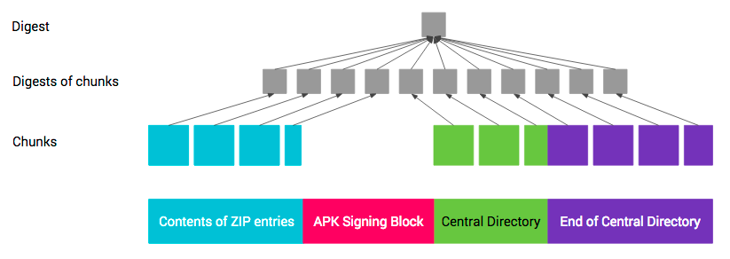
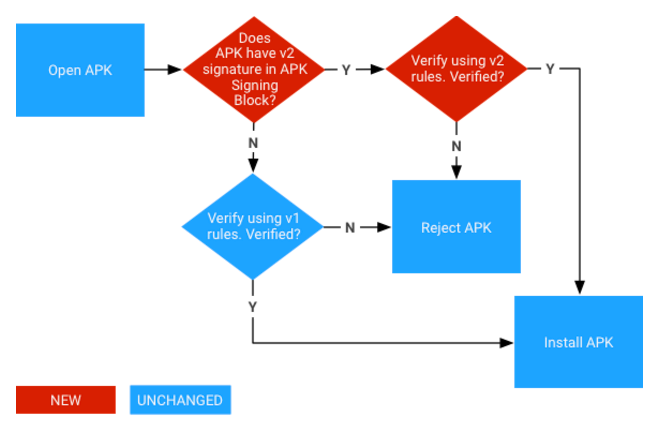

# Схема подписи APK ГОСТ v2

Схема подписи APK ГОСТ v2 - это основанная на существующей схеме подписи APK v2 схема, которая имеет свой собственный идентификатор `ID` и в которой применяются отечественные алгоритмы хэширования `ГОСТ Р 34.11-2012 (256)` и подписи `ГОСТ Р 34.10-2012 (256)`. 

Схема подписи APK v2 — это схема подписи всего файла APK, которая увеличивает скорость проверки и [усиливает гарантии целостности](#integrity-protected-contents) за счет обнаружения любых изменений в защищенных частях APK.

При подписании с использованием схемы подписи APK ГОСТ v2 [блок подписи APK](#apk-signing-block) вставляется в файл APK непосредственно перед разделом центрального каталога ZIP. Внутри блока подписи APK подписи ГОСТ v2 и идентификационная информация подписывающего лица хранятся в [блоке схемы подписи APK ГОСТ v2](#apk-signature-scheme-v2-block).

Схема подписи APK v2 была представлена в Android 7.0 (Nougat). Чтобы APK можно было установить на устройствах Android 6.0 (Marshmallow) и более ранних версий, перед подписанием по схеме v2 необходимо подписать APK с использованием [подписи JAR](https://source.android.com/docs/security/features/apksigning?hl=ru#v1).

Создание блока подписи APK ГОСТ v2 осуществляется путем ее добавления (`append-signature`) в уже существующий блок подписи, как отдельной пары `ID-value pair`.

## Блок подписи APK {#apk-signing-block}

Для обеспечения обратной совместимости с форматом APK версии 1 подписи APK версии 2 и более новых хранятся внутри блока подписи APK — нового контейнера, представленного для поддержки схемы подписи APK v2. В APK-файле блок подписи APK расположен непосредственно перед центральным каталогом ZIP, который находится в конце файла.

Блок содержит пары идентификатор-значение, упакованные таким образом, чтобы его было легче найти в APK.
Подпись APK ГОСТ v2 хранится в виде пары идентификатор-значение с идентификатором `0x2f02bfc7`.
Подпись добавляется (`append-signature`) после всех существующих в блоке подписи `ID-value pair`.

### Формат {#apk-signing-block-format}

Формат блока подписи APK следующий (все числовые поля имеют прямой порядок байтов):

* `size of block` в байтах (без учета этого поля) (uint64)

* Последовательность пар идентификатор-значение с префиксом длины uint64:

    * `ID` (uint32)
    * `value` (variable-length: длина пары — 4 байта)
    
* `size of block` в байтах — такой же, как и самое первое поле (uint64)

* `magic` «APK Sig Block 42» (16 байт)

APK анализируется путем обнаружения начала центрального каталога ZIP (путем обнаружения записи конца ZIP центрального каталога в конце файла, а затем считывания начального смещения центрального каталога из записи). `magic` значение позволяет быстро определить, что то, что предшествует Central Directory, скорее всего, является блоком подписи APK. Тогда `size of block` указывает на начало блока в файле.

Android игнорирует пары идентификатор-значение с неизвестными идентификаторами при интерпретации блока подписи.

## Блок схемы подписи APK ГОСТ v2 {#apk-signature-scheme-v2-block}

APK подписывается одним или несколькими подписывающими лицами/идентификаторами, каждый из которых представлен ключом подписи. Эта информация хранится в виде блока схемы подписи APK ГОСТ v2. 
Для каждого подписывающего лица сохраняется следующая информация:

* (алгоритм подписи, хэш, подпись) кортежи. Хэш сохраняется, чтобы отделить проверку подписи от проверки целостности содержимого APK.
* Цепочка сертификатов X.509, представляющая личность подписывающего лица.
* Дополнительные атрибуты в виде пар ключ-значение.

Для каждого подписывающего лица APK проверяется с использованием поддерживаемой подписи из предоставленного списка.
Дополнительные атрибуты подписи отсутствуют.

Список поддерживаемых алгоритмов представлен только парой `ГОСТ Р 34.11-2012 (256)` и `ГОСТ Р 34.10-2012 (256)`.

### Формат {#apk-signature-scheme-v2-block-format}

Блок схемы подписи APK ГОСТ v2 хранится внутри блока подписи APK под идентификатором `0x2f02bfc7`.

Формат блока схемы подписи APK ГОСТ v2 следующий (все числовые значения имеют прямой порядок байтов, все поля с префиксом длины используют uint32 для длины):

* Последовательность с префиксом длины signer с префиксом длины:

    * `signed data` префиксом длины:
    
        * последовательность `digests` с префиксом длины:
        
            * `signature algorithm ID` (uint32)
            * (с префиксом длины) `digest` — см. [содержимое, защищенное от целостности](#integrity-protected-contents).
            
        * Последовательность certificates X.509 с префиксом длины:
        
            * certificate X.509 с префиксом длины (форма ASN.1 DER)
            
        * последовательность `additional attributes` с префиксом длины:
        
            * `ID` (uint32)
            * `value` (variable-length: длина дополнительного атрибута — 4 байта)
            
    * последовательность `signatures` с префиксом длины:
    
        * `signature algorithm ID` (uint32)
        * `signature` с префиксом длины над `signed data`
        
    * Открытый `public key` с префиксом длины (SubjectPublicKeyInfo, форма ASN.1 DER)

#### Идентификаторы алгоритмов подписи APK ГОСТ v2 {#signature-algorithm-ids}

* 0xff00 - ГОСТ Р 34.10-2012 (256) с хэшом ГОСТ Р 34.11-2012 (256)

Вышеперечисленные алгоритмы подписи НЕ поддерживаются платформой Android.

**Поддерживаемые размеры ключей и кривые ГОСТ Р 34.10-2012 (256):**

* ГОСТ 2012 (256): ГОСТ Р 34.10-2012 256 бит (параметры ТК-26, набор A; параметры ТК-26, набор B; параметры ТК-26, набор C; параметры ТК-26, набор D)
* ГОСТ 2001 (256): ГОСТ Р 34.10 256 бит (параметры по умолчанию; параметры Оскар 2.x; параметры подписи 1; параметры обмена по умолчанию; параметры обмена 1)

## Содержимое, защищенное целостностью {#integrity-protected-contents}

В целях защиты содержимого APK последний состоит из четырех разделов:

1. Содержимое записей ZIP (от смещения 0 до начала блока подписи APK)
2. Блок подписи APK
3. Центральный каталог ZIP
4. ZIP Конец центрального каталога

Схема подписи APK ГОСТ v2 защищает целостность разделов 1, 3, 4 и `signed data` блока схемы подписи APK ГОСТ v2, содержащихся внутри раздела 2.

Целостность разделов 1, 3 и 4 защищена одним или несколькими хэшами их содержимого, хранящимися в `signed data`, которые, в свою очередь, защищены одной или несколькими подписями.

Хэш по разделам 1, 3 и 4 рассчитывается следующим образом, аналогично двухуровневому [дереву Меркла](https://en.wikipedia.org/wiki/Merkle_tree). Каждый раздел разделен на последовательные фрагменты по 1 МБ (2 20 байт). Последний фрагмент в каждом разделе может быть короче. Хэш каждого фрагмента вычисляется путем объединения байта `0xa5`, длины фрагмента в байтах (uint32 с прямым порядком байтов) и содержимого фрагмента. Хэш верхнего уровня вычисляется на основе объединения байта `0x5a`, количества фрагментов (с прямым порядком байтов uint32) и объединения хэшей фрагментов в том порядке, в котором фрагменты появляются в APK. Хэш вычисляется по частям, чтобы ускорить вычисления за счет их распараллеливания.

Защита раздела 4 (конец ZIP центрального каталога) усложняется разделом, содержащим смещение центрального каталога ZIP. Смещение меняется при изменении размера блока подписи APK, например, при добавлении новой подписи. Таким образом, при вычислении хэша по концу ZIP центрального каталога поле, содержащее смещение центрального каталога ZIP, должно рассматриваться как содержащее смещение блока подписи APK.

## Проверка {#verification}

В Android 7.0 и более поздних версиях APK-файлы можно проверять по схеме подписи APK v2+ или подписи JAR (схема v1).

Подпись на ГОСТ алгоритме может быть только в формате v2. Android игнорирует неизвестные `ID`, поэтому проверка подписи возможна только программно в вызывающем коде.

### Проверка схемы подписи APK ГОСТ v2 {#v2-verification}

1. Найти блок подписи APK и убедиться, что:

    a. Два поля размера блока подписи APK содержат одно и то же значение.
    b. Сразу за ZIP Central Directory следует запись ZIP End of Central Directory.
    c. ZIP Конец центрального каталога не сопровождается дополнительными данными.
    
2. Найти первый блок схемы подписи APK ГОСТ v2 внутри блока подписи APK. Если блок ГОСТ v2 присутствует, перейти к шагу 3, иначе отсутствие блока будет интерпретировано, как ошибка.

3. Для каждого signer в блоке схемы подписи APK ГОСТ v2:

    a. Выбрать самый надежный `signature algorithm ID` из `signatures`. Степень надежности зависит от каждой версии реализации.
    b. Проверить соответствующую `signature` из `signatures` против `signed data` с помощью `public key`. (Теперь можно безопасно анализировать `signed data`.)
    c. Убедиться, что упорядоченный список идентификаторов алгоритмов подписи в `digests` и `signatures` идентичен. (Это сделано для предотвращения удаления/добавления подписи.)
    d. [Вычислить хэш содержимого APK](#integrity-protected-contents), используя тот же алгоритм хэша, что и алгоритм хэша, используемый алгоритмом подписи.
    e. Убедиться, что вычисленный хэш идентичен соответствующему `digest` из `digests`.
    f. Убедиться, что subjectPublicKeyInfo первого `certificate` `certificates` идентичен `public key`.
    
4. Проверка считается успешной, если был найден хотя бы один `signer` и шаг 3 выполнен успешно для каждого найденного `signer`.

## Ресурсы

* https://source.android.com/docs/security/features/apksigning/v2?hl=ru
* https://android.googlesource.com/platform/tools/apksig/
* https://cryptopro.ru/products/csp/compare#supported_algorithms